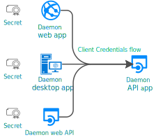

# Micronaut Azure OAuth 2.0 Client Credentials Flow
Ref: [Microsoft identity platform and the OAuth 2.0 client credentials flow](https://docs.microsoft.com/en-us/azure/active-directory/develop/v2-oauth2-client-creds-grant-flow)

---

This scenario demonstrates [Daemon application that calls web APIs](https://docs.microsoft.com/en-us/azure/active-directory/develop/scenario-daemon-overview)
using [Micronaut](https://docs.micronaut.io/latest/guide/index.html).
For example, this can be used in an SPA that calls a REST API on behalf of itself.
  
(Schematic from Azure documentation)

### Steps
1. Login to portal.azure.com
1. Note down OAUTH_TENANT_ID
1. Register api app in App Registration
   1. Display Name: OAuth_App
   1. Note down client_id from overview page as OAUTH_CLIENT_ID
   1. Create and note down client_secret as OAUTH_CLIENT_SECRET
   1. Set Application ID URI: api://${OAUTH_CLIENT_ID}
   1. Add two app roles
      1. HelloRole with value=HelloRole
      1. WorlfRole with value=WorldRole
   1. Via "Manage application in local directory", enable "User assignment required?"
1. Open this project in IntelliJ IDEA and update all OAUTH_* values in the run configuration
1. Register another app to represent a daemon SPA
   1. Display Name: SPA_App
   1. Note down client_id from overview page as client_id
   1. Create and note down client_secret as client_secret
   1. Add API permission for OAuth_App under My APIs; select both roles.
1. Import resources/MicronautAzureOAuth.postman_collection in postman
1. Update all variables (OAUTH_*, client_id and client_secret) in Postman environment
1. Get bearer token using request POST-SP-BearerToken in Postman
1. Run this project in Idea and check requests in Postman
---

## Feature security-jwt documentation

- [Micronaut Security JWT documentation](https://micronaut-projects.github.io/micronaut-security/latest/guide/index.html)

## Feature security-oauth2 documentation

- [Micronaut Security OAuth 2.0 documentation](https://micronaut-projects.github.io/micronaut-security/latest/guide/index.html#oauth)

## Feature http-client documentation

- [Micronaut HTTP Client documentation](https://docs.micronaut.io/latest/guide/index.html#httpClient)

